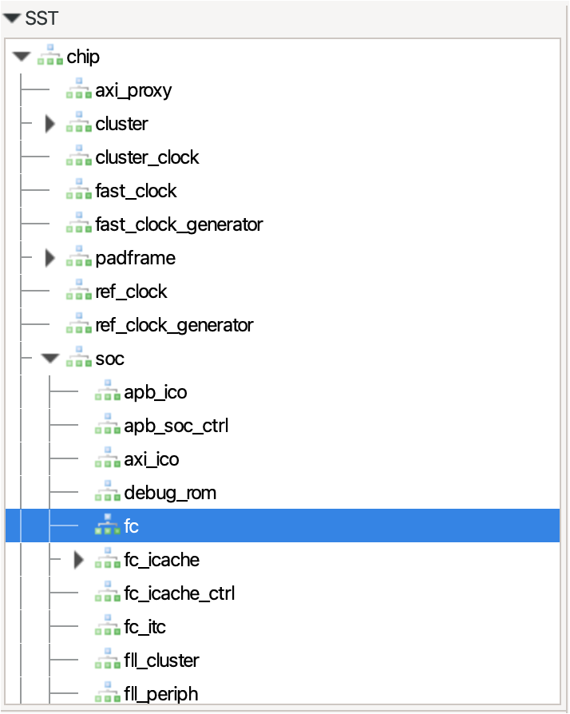

# Interrupt test
Compile and run the interrupt test:
~~~~~shell
make clean all run
~~~~~

The expected output is the following:
```
Ticks=334
HELLO 1 (if =1, ISR has worked)!
Start=2
End=336 vs set=336
```

## Available tests
You can change the target tests (defualt `test1.c`) by modifying the `Makefile` appropriately:
 - `test1.c`: simple timer + interrupt test with wait-for-interrupt after 10 milliseconds
 - `test2.c`: loop of 64 intervals of 10ms each with timer+WFI; timer is re-armed outside of the IRQ handler
 - `test3.c`: same as `test2.c` but with GPIO toggling
 - `test4.c`: same as `test3.c` but timer re-arming and GPIO toggling are performed *inside* the IRQ handler
 - `test5.c`: simple timer + interrupt test without WFI (emulates asynchronous interrupt)
 - `uart.c`: bit-banged UART

## What to check
### Disassembling the binary
To disassemble the binary, launch
```
make dis > disassembly.S
```
Then, open `disassembly.S` in the editor.
As the tab size used internally is 8, it is recommended to set the editor tab size to 8 as well to read this file (*CTRL+SHIFT+P* > *Change tab display size*).
The most interesting piece of code is `timer_handler`, which should look like this for `test1.c`:
```
1c008706 <timer_handler>:
1c008706:	1141                	addi	sp,sp,-16
1c008708:	c43e                	sw	a5,8(sp)
1c00870a:	1c0017b7          	lui	a5,0x1c001
1c00870e:	26078793          	addi	a5,a5,608 # 1c001260 <_edata>
1c008712:	c63a                	sw	a4,12(sp)
1c008714:	4398                	lw	a4,0(a5)
1c008716:	0705                	addi	a4,a4,1
1c008718:	c398                	sw	a4,0(a5)
1c00871a:	4732                	lw	a4,12(sp)
1c00871c:	47a2                	lw	a5,8(sp)
1c00871e:	0141                	addi	sp,sp,16
1c008720:	30200073          	mret
```
Let's examine this step by step.
First, we create a stack frame for the handler function:
```
1c008706:	1141                	addi	sp,sp,-16
```
Then, we save the current value of a register that is used inside the IRQ handler (namely `a5`), which is then used to host the static address `0x1c001260` into `a5`: this is the address of the global variable `global`:
```
1c008708:	c43e                	sw	a5,8(sp)
1c00870a:	1c0017b7          	lui	a5,0x1c001
1c00870e:	26078793          	addi	a5,a5,608 # 1c001260 <_edata>
```
Then, we save `a4` in the stack and then we use it as temporary register to load `global`, increment it by 1, and then store it back to memory:
```
1c008712:	c63a                	sw	a4,12(sp)
1c008714:	4398                	lw	a4,0(a5)
1c008716:	0705                	addi	a4,a4,1
1c008718:	c398                	sw	a4,0(a5)
```
As cleanup, we reload the original values of `a4`, `a5` and destroy the stack frame:
```
1c00871a:	4732                	lw	a4,12(sp)
1c00871c:	47a2                	lw	a5,8(sp)
1c00871e:	0141                	addi	sp,sp,16
```
Finally, we return with `mret`:
```
1c008720:	30200073          	mret
```

### Tracing execution
To run with instruction tracer,
```
make run runner_args="--trace=insn" > trace.log
```
and open `trace.log` in the editor.

### Visual waveforms
To save waveforms for visualization, run
```
make run runner_args="--vcd --event=.*"
```
To visualize the VCD, the recommended open-source tool is GTKWave (https://gtkwave.github.io/gtkwave/).
Then you can run
~~~~~shell
gtkwave BUILD/PULP/GCC_RISCV/all.vcd
~~~~~
Inside GTKWave, you can add relevant waveforms through the hierarchy navigator:

Most interesting signals are located within `chip > soc > fc` (in particular `irq_enable`, `irq_enter`, `irq_exit`, `busy`, `pc`) and within `chip > soc > gpio` (in particular `padout`).
